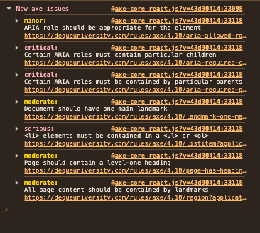

# 접근성이 필요한 이유

웹 접근성은 모두가 우리 사이트를 이용할 수 있도록 디자인, 개발하는것을 의미합니다. 또한 assistive technology 들이 웹페이지들을 해석할 수 있도록 접근성을 갖추는 것이 필요합니다. 

# 1. 시맨틱 태그 사용하기

```jsx

			<Fragment>
			<nav className="tabs">
				<ul className="tab-navigation">
					<li>
						<input
							type="radio"
							id="tab-1"
							/>
						<label htmlFor="tab-1">
							All
						</label>
					</li>
					<li>
						<input
							type="radio"
							id="tab-2"
							/>
						<label htmlFor="tab-2">
							Web Design
						</label>
					</li>
					<li>
						<input
							type="radio"
							id="tab-3"
							 />
						<label htmlFor="tab-3">
							Social Media
						</label>
					</li>
					<li>
						<input
							type="radio"
							id="tab-4"
							/>
						<label htmlFor="tab-4">
							Creative
						</label>
					</li>
				</ul>
			</nav>
			<section>
				탭내용1
			</section>
			<section>
				탭내용2
			</section>
			<section>
				탭내용3
			</section>
			<section>
				탭내용4
			</section>
			</Fragment>
```

- 탭 컴포넌트 만들기
    - **`<nav>`**: 탭 네비게이션을 감싸는 컨테이너로, 페이지 내에서 사용자가 다른 섹션으로 이동할 수 있도록 돕는 역할을 합니다. 네비게이션을 표시할 때 `div` 대신 `<nav>`를 사용하면, **접근성과 의미 전달**이 더욱 좋아집니다. 검색 엔진과 스크린 리더는 `<nav>` 태그를 통해 이 요소가 페이지 탐색과 관련된 부분임을 이해합니다.
    - **`<ul>`과 `<li>`**: 탭 메뉴의 각 항목은 리스트로 구성되어 있습니다. **`<ul>`**(unordered list)은 항목들이 나열된 리스트임을 나타내며, 각 탭은 **`<li>`** 요소로 포함됩니다. 이렇게 하면 **구조적 의미가 명확해지고** 유지보수와 접근성 면에서도 유리합니다.
    - **`<section>`**: 각 탭의 콘텐츠는 독립적인 콘텐츠 블록이므로 `<section>` 태그를 사용하여 의미를 명확히 했습니다. `<section>`은 관련 콘텐츠를 그룹화하는 데 유용하며, 검색 엔진과 스크린 리더에게 각 탭의 콘텐츠가 독립적인 섹션임을 전달할 수 있습니다.
    - `input` : 탭이지만 엄밀히 말하자면 탭이 아닌 radio button을 사용했습니다. 그 이유는 키보드로 접근 가능할 수 있도록 하기 위해 form태그를 사용하였습니다. tab메뉴라는 것을 알려주기 위해 아래에서 role을 추가해 줌으로써 해결 가능합니다.
    - `label` :  label htmlFor와 input의 id를 연결해 줌으로써 라벨을 클릭시에도 라디오가 선택되도록 할 수 있습니다.
- 추가적으로 의미없이 div를 사용하는 것보단 fragment를 사용하는 것이 좋습니다.

# WAI-ARIA

접근성을 갖춘 js사이트를 만드는데 필요한 기술들을 안내하고 있습니다. 

JSX에서는 모든 `aria-*` HTML 어트리뷰트를 지원하고 있습니다.  

1. Aria-selected: 선택된 tab은 스크린리더 사용자에게 선택된 tab 임을 알려주어야 하므로 aria-selected true, false를 사용하여 선택된 tab 요소를 알려줍니다.
2. Aria-label: tab 리스트가 어떠한 tab 리스트인지 스크린리더 사용자에게 알려주어야 할 때 사용합니다.  현재 구현된 탭의 경우 label이 있으므로 추가하지 않아도 무방합니다. 
3. Aria-controls: aria-controls는 선택한 요소에 영향을 받는 하위 요소가 현재 포커스 한 라인과 떨어져 있을 경우 스크린리더 사용자가 하위 요소가 열린 위치를 파악하기 어려우므로 관련된 하위 요소로 바로 이동할 수 있도록 해 주는 역할을 합니다. Tab 역시 특정 tab을 선택한 경우 tab 패널이 시작되는 부분으로 바로 이동할 수 있도록 aria-controls를 포함할 수 있습니다. 탭과 탭패널을 연결해 줍니다. 
4. Aria-labeled-by : **화면 리더**와 같은 접근성 도구가 특정 요소를 설명할 때, **다른 요소에 있는 텍스트를 참조하도록 하는 속성**입니다. 쉽게 말해서, **어떤 요소에 대한 설명을 다른 요소에서 가져오도록 지정**하는 것입니다.화면 리더는 `tab-content-1`을 읽을 때 "Tab 1"이라고 설명하고, 사용자는 이 콘텐츠가 "Tab 1"과 연결되어 있다는 것을 알 수 있습니다.
5. role : radio에 role을 추가해 줌으로써 tab컴포넌트라는걸 명시해 줄 수 있습니다. 
    1. Tab list: tab, tab panel을 하나의 그룹으로 묶어 ‘tab list’라고 표현합니다. 만약 같은 페이지에 두 개의 tab 섹션이 있다면 두 개의 tab 리스트가 존재하는 것이 됩니다.
    2. Tab: tab 리스트의 하위 영역으로 각각의 tab 요소를 일컫습니다. 만약 하나의 tab 리스트에 4개의 선택 가능한 요소가 있다면 4개의 tab이 존재하는 것이 됩니다.  role="tab"을 사용하여 tab 컨트롤을 구현하면 스크린리더가 tab 컨트롤에 접근했을 때 `'접근성 블로그 tab, 선택됨, 2/4'와 같이 전체 tab 및 현재 선택된 tab이 몇 번째 tab 인지를 알려주게 됩니다.`
    3. Tab 패널: 각각의 tab 하위 콘텐츠를 가리킵니다. 사용자가 tab 중 하나를 선택할 때마다 관련된 tab 패널은 변경되며 처음 페이지 로딩 시 tab 요소 중 하나는 항상 선택된 상태이므로 하나의 tab 패널 역시 표시된 상태가 됩니다.
    
    ```jsx
    <!-- 탭 -->
              <ul role='tablist'>
              <li>
    						<input
    							id="tab-1"
    							type="radio"
    							aria-controls="tabpanel-1"
    							aria-selected={currentTab === 1}
    							role="tab"
    						/>
    						<label htmlFor="tab-1" id="tab-txt1">
    							All
    						</label>
    					</li>
    					
    <!-- 탭 패널 -->
    					<div
    				className="tab-content"
    				id="tabpanel-1"
    				role="tabpanel"
    				 aria-labelledby="tab-txt1"
    			>
    				탭내용1
    			</div>
    ```
    

# Form

html에서 for은 react에서 htmlfor로 사용해야 합니다. 

```jsx
<label htmlFor="namedInput">Name:</label>
```

# 키보드로 포커스 컨트롤하기


마우스 없이 키보드 만으로도 탭에 접근이 자유로워야 합니다. 

앞서 aria- 설정을 통해 방향키로 탭 이동이 가능해지고, 탭키를 통해 패널로 이동이 가능해졌습니다. 

더 명확한 인터페이스와 사용자 경험을 개선하기 위해 엔터키로 탭패널 이동이 가능하게 해보겠습니다. 

- handleKeyDown을 사용하여 탭에서 enter를 눌렀을때 탭패널로 이동가능하게 만들어 줍니다.
- tabIndex
    - **tabindex=“0” :** 상호작용하지 않는 `<div>`나 `<span>`과 같은 요소에도 키보드 포커스가 잡히게 하고 싶을 경우에는 어떻게 해야 할까요? 해당 요소의 `tabindex` 속성을 `0`으로 설정해주면 마치 상호작용이 가능한 요소처럼 해당 요소로 포커스가 이동하게 됩니다.
    - **tabindex=“-1” :** 반대로 원래 상호작용하는 요소에 포커스가 잡히지 않게 하려면 어떻게 해야 할까요? 해당 요소의 `tabindex` 속성을 `-1`로 설정해주면 상호작용이 가능한 요소라도 포커스가 이동하지 않게 됩니다.
    - **tabindex=“양수” :**기본적으로 키보드 포커스는 `tab` 키를 누르면 HTML 문서 상에서 요소들이 배치된 순서대로, `shift` 키와 `tab` 키를 함께 누르면 역순으로 이동하는데요. `tabindex` 속성에 1 이상의 양수값을 설정하여 요소들 간에 포커스가 잡히는 순서를 강제로 변경할 수도 있습니다.

```jsx
	const handleKeyDown = (event, panelId) => {
		// Enter 키가 눌렸을 때 관련 탭 패널로 포커스를 이동
		if (event.key === "Enter") {
			document.getElementById(panelId).focus();
		}
	};
	
	<input
							type="radio"
							aria-controls="tabpanel-1"
							aria-selected={currentTab === 1}
							name="tab"
							id="tab-1"
							checked={currentTab === 1}
							role="tab"
							onChange={() => setCurrentTab(1)}
							tabIndex="0"
							onKeyDown={(e) => handleKeyDown(e, "tabpanel-1")}
						/>
```

# 테스트 해보기

- 크롬 스크린 리더 : 직접 스크린 리더를 실행시켜 볼 수 있습니다. (설치하자 마자 리더가 읽기 시작하므로 깜짝 놀랄 수 있습니다. ) https://chromewebstore.google.com/detail/screen-reader/kgejglhpjiefppelpmljglcjbhoiplfn?hl=en
- react library : 라이브러리를 실행하여 콘솔창을 통해 오류를 확인할 수 있습니다. 나름 꼼꼼히 챙겨서 작업하였으나, 저는 약7의 오류를 발견할 수 있었습니다.

https://github.com/dequelabs/axe-core-npm/tree/develop/packages/react

- 오류를 보고 디버깅을 해보니 꼭 맞는 탭컴포넌트에 맞는 오류는 아닌것으로 확인되어 완전한 적용은 어려울것 같습니다.

```jsx
import("@axe-core/react").then(
	({ default: axe }) => axe(React, ReactDOM, 1000, {}),
	({ message }) => console.error(message)
);
```



- lint : 린트설정을 통해 개발단계에서 보완해나갈 수 있습니다.

https://github.com/infofarmer/eslint-plugin-jsx-a11y

---

어렵다고 생각한 접근성 테스트를 생각보다 쉽게 해결할 수 있었습니다. 

빠르게 개발을 하다보면 이런 접근성을 놓치곤 하는데, 이번기회에 최대한 접근성을 챙겨볼 수 있었습니다. 

---

도움을 받은 자료들

https://www.w3.org/WAI/ARIA/apg/patterns/tabs/examples/tabs-automatic/

[CSS로 탭메뉴 기능 완성은 기본! 접근성까지 될수있을까?!](https://youtu.be/0iuTF-czN6I?si=YiyzWutK-OkO2gkI)

https://ko.legacy.reactjs.org/docs/accessibility.html