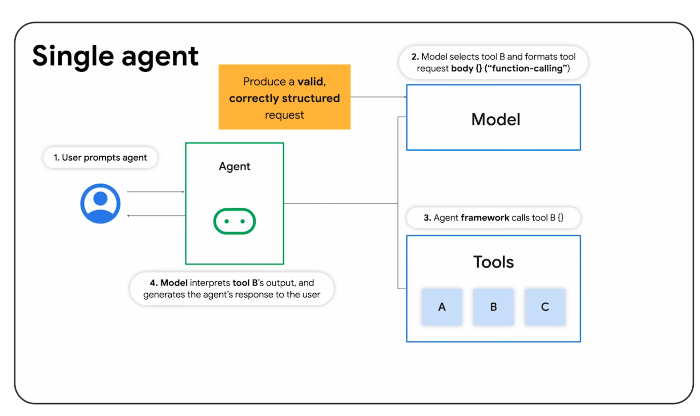
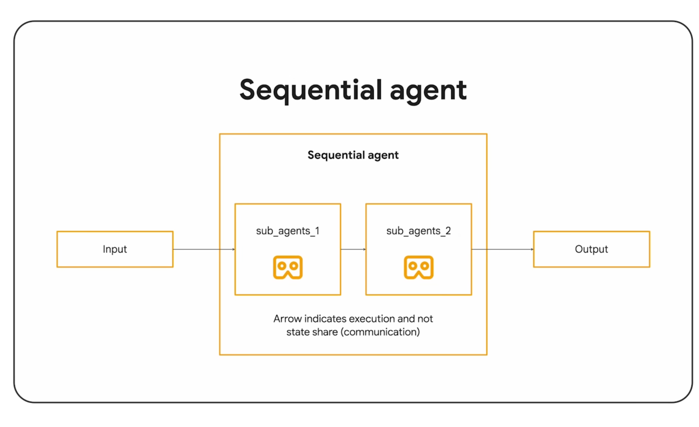
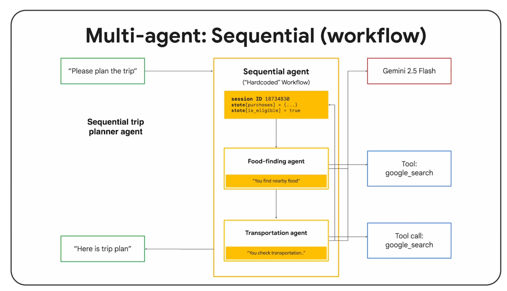
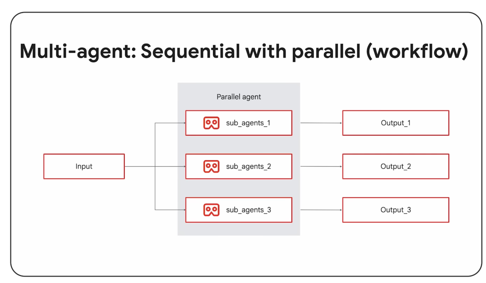
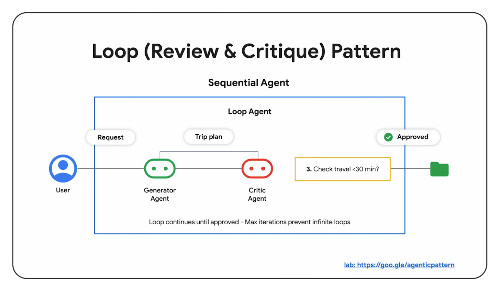
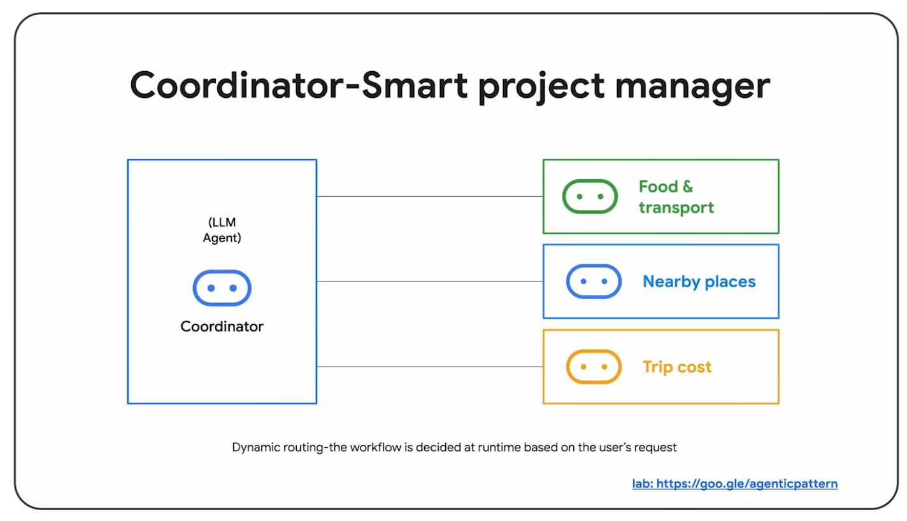
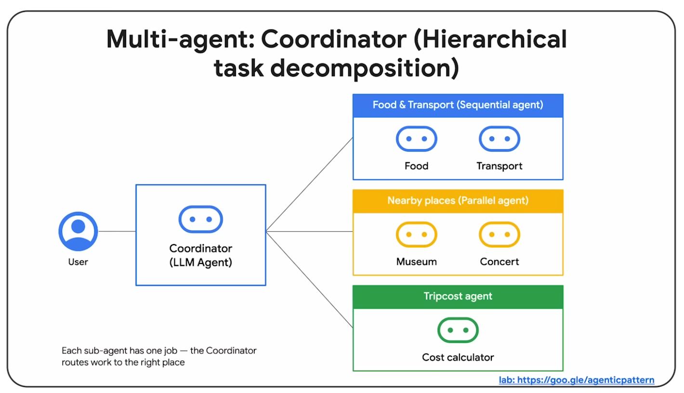
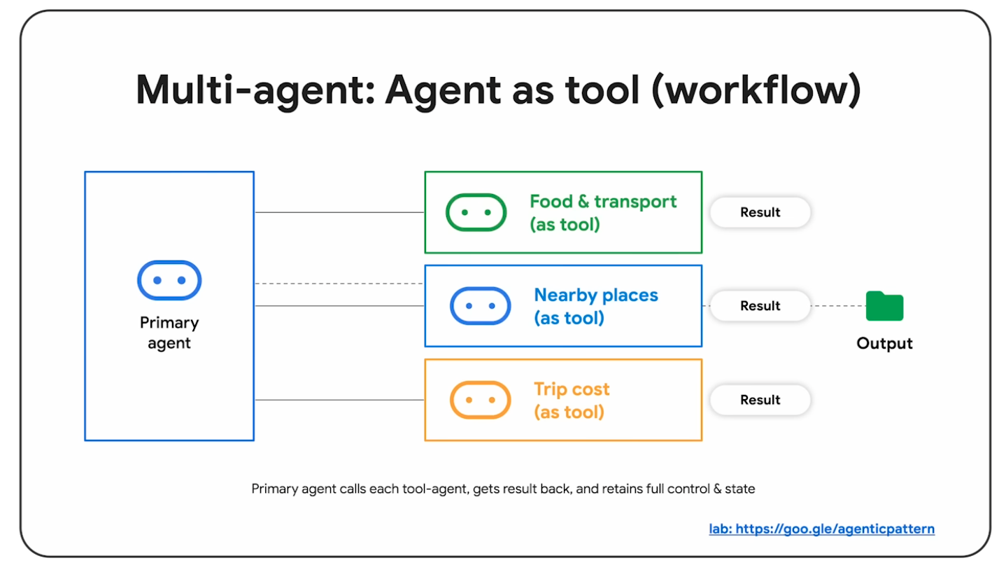
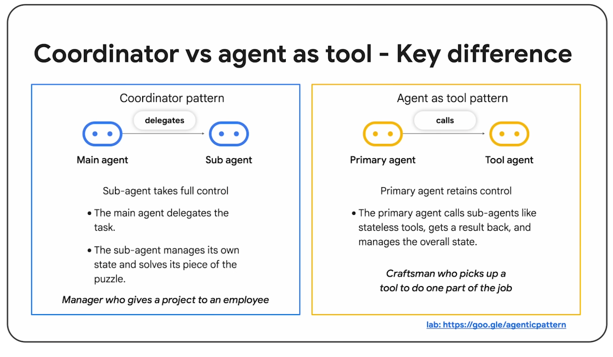
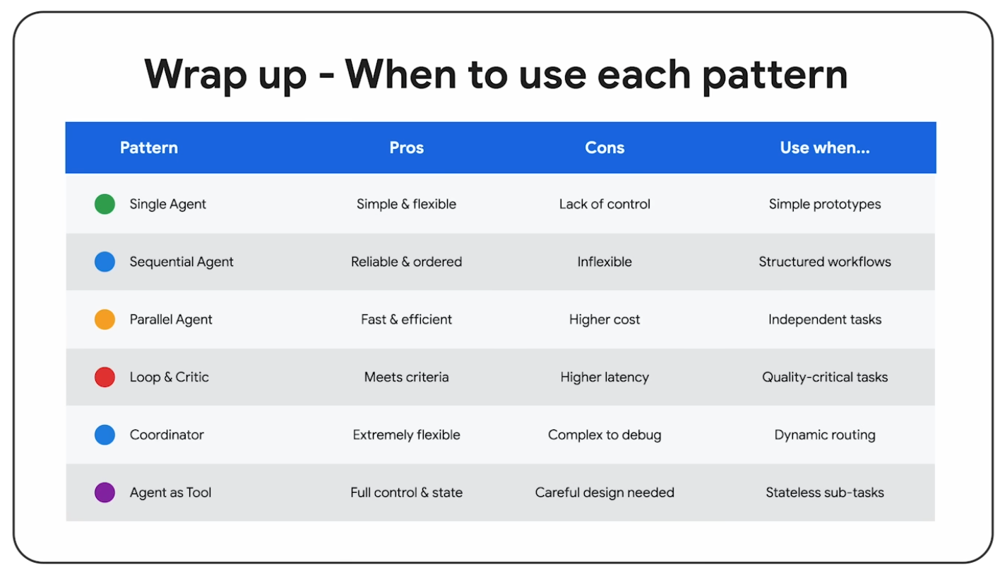

**AI agent에도 디자인 패턴이 있다는 사실을 아시나요?**

AI로 무언가를 만들어보면 금방 느끼는 지점이 있습니다. 처음엔 “프롬프트를 잘 쓰면 되겠지” 싶지만, 요구사항이 하나씩 붙기 시작하면 금방 복잡해집니다. 조건이 추가되고, 예외 처리가 들어가고, 실패했을 때 어떻게 할지도 정해야 하니까요.

그래서 필요한 게 ‘패턴’입니다. 한 덩어리 프롬프트로 밀어붙이기보다, 역할을 나누고 실행 흐름을 정리해서 **예측 가능하고 유지보수 가능한 구조**로 만드는 방법이에요.

## 왜 AI agent 디자인 패턴을 알아야 하나

**프롬프트만으로는 금방 한계가 옵니다.** 처음엔 간단해도, 요구가 늘수록 “한 번에 말로 해결”이 아니라 “단계를 나눠서 처리”해야 할 문제가 생깁니다.

**결과가 들쭉날쭉하면 실무에 못 씁니다.** 같은 질문을 해도 답이 매번 다르면 서비스에 넣기 어렵죠. 그래서 “초안 → 체크(규칙/테스트/근거 확인) → 수정” 같은 검수 루프를 구조로 만들어 품질을 안정화합니다.

**시간과 토큰은 항상 부족합니다.** 길게 돌리면 정확해질 것 같지만, 실제로는 “필요한 부분만” 돌리는 게 더 중요합니다. 그래서 급한 건 빠르게, 리서치/정리는 병렬로, 마지막에만 검수로 마무리하는 식으로 균형을 맞출 수 있어요.

**에러가 나면 어디가 문제인지 바로 보이게 해야 합니다.** 한 덩어리 프롬프트는 “왜 망했지?”로 끝나기 쉽지만, 단계가 분리되면 검색/요약/검증 중 어디에서 틀어졌는지 추적하기가 훨씬 편해집니다.

**팀 작업이 됩니다.** 리서치, 작성, 검증처럼 역할을 나누면 특정 단계만 개선하기 쉬워요. 그리고 그 구조는 다음 작업에도 그대로 재사용할 수 있습니다.

**현실에서는 ‘확인’이 필요합니다.** 에이전트는 그럴듯하게 말할 수 있어도, 우리는 실제 데이터(검색/DB/로그/테스트)로 확인해야 합니다. 패턴은 “언제 툴로 확인할지”, “실패하면 어떻게 대체할지”까지 흐름에 넣는 쪽으로 설계되어 있습니다.

## Pattern 1. Single agent

단일 에이전트가 계획부터 툴 호출, 결과 조합까지 한 번에 처리하는 방식입니다.

어울리는 경우는 대체로 이렇습니다.
- **목표가 하나**일 때: “샌프란시스코 여행 계획 세워줘” 같은 요청
- 요청이 조금 섞이더라도 한 번에 끝낼 수 있을 때: “늦게 여는 일식집 찾아서, 거기까지 가장 빠른 길까지 안내해줘”

장점은 구현이 단순하고 디버깅이 쉽다는 점이에요. 반대로 요구사항이 커지면 프롬프트가 비대해지고, 품질 통제가 어려워집니다. 결국 이 패턴은 “작게 시작해서, 커지면 다음 패턴을 고민”하는 경우가 많습니다.

## Pattern 2. Sequential agent (Pipeline)

여러 서브 에이전트를 **순서대로** 실행하는 방식입니다. 파이프라인이라고 생각하면 됩니다.

예를 들면,
- 식당 후보 찾기 → 교통/경로 계산 → 최종 요약/추천

장점은 흐름이 명확해서 결과가 예측 가능하고, 단계별로 테스트/디버깅이 쉽다는 점입니다. 또 필요한 단계만 두고 조절할 수 있어서 비용 관리도 상대적으로 편해요.

단점은 “순서대로만” 가야 한다는 점입니다. 중간에 상황이 바뀌면 유연하게 스킵/재계획하기가 어렵고, 무엇보다 단계가 길어지면 누적 latency가 생깁니다.

## Pattern 3. Parallel agent

서로 독립적인 작업을 동시에 돌리고, 결과를 합쳐서 내는 방식입니다.

예를 들면 “식당 후보 탐색”과 “이동 수단/소요 시간 탐색”을 동시에 진행한 뒤 추천을 만드는 식이죠.

이 패턴의 장점은 전체 latency를 줄일 수 있다는 겁니다. sequential의 예측 가능성은 어느 정도 유지하면서 속도를 개선할 수 있어요.

대신 의존성/상태를 관리해야 하고, 결과가 어긋나면 디버깅이 어려워질 수 있습니다. 병렬로 돌릴수록 신경 쓸 포인트가 생기는 느낌이라고 보면 됩니다.

## Pattern 4. Loop pattern (Review & Critique)

초안이 나오면 끝내지 않고, 평가하고 수정한 다음 다시 시도하는 구조입니다. 말 그대로 “검수 루프”예요.

예시로는,
- 답변 초안 생성 → 규칙/테스트로 검증 → 실패하면 다시 생성/수정
- 코드 생성 → 빌드/테스트 → 에러 로그를 보고 수정 반복

장점은 단발성 추론보다 품질과 정확도를 끌어올리기 좋다는 점입니다. 특히 코드/리서치/정리처럼 “정답이 한 번에 안 나오는” 작업에 잘 맞아요.

단점은 반복 횟수만큼 시간과 비용이 늘 수 있다는 겁니다. 그래서 무한 루프를 막는 조건이 꼭 필요하고, 무엇보다 “뭘 기준으로 평가할지”를 잘 설계해야 합니다.

## Pattern 5. Coordinator (Router) pattern

상위(감독) 에이전트가 목표를 쪼개고, 그걸 하위 에이전트/팀에 나눠준 다음 결과를 모아오는 방식입니다.

이 패턴은 “고정된 파이프라인으로는 답이 안 나오는” 상황에서 특히 편해요. 예를 들어 작업 종류가 다양해서 단계가 케이스마다 달라지는 경우죠.

장점은 확장성이 좋다는 점입니다. 하위 워커를 더 작고 전문적으로 유지할 수 있고, 상황에 따라 동적으로 라우팅도 가능합니다.

반대로 이 구조는 감독의 품질이 전체 품질에 그대로 영향을 줍니다. 상태/메모리 공유, 결과 충돌 처리, 취합 기준 같은 설계가 필요해서 복잡도가 올라가고, 라우팅/취합 과정에서 추가 호출로 latency와 비용도 늘 수 있어요.

## Pattern 6. Agent as Tool

LLM을 중심으로 두되, 필요한 순간에 검색/DB/코드 실행 같은 툴을 호출해서 실제 환경과 맞물리게 만드는 방식입니다.

이 패턴은 “모델이 생각하고, 툴이 사실을 가져오게 만든다”는 감각이 핵심이에요. 그래서 성능이 오르려면 추론만이 아니라 툴 결과까지 결합되어야 합니다.

또 툴이 실패할 때(권한/재시도/대체)는 어떻게 처리할지도 포함해서 설계를 해야 합니다. 실제로 여기서 품질이 갈리더라고요.

## Pattern 5 vs 6: Coordinator(Router) vs Agent as Tool

둘 다 “한 에이전트가 다 한다”에서 벗어나는 구조지만, 초점이 다릅니다.

### 차이

- **Pattern 5(Coordinator/Router)**: “어떤 작업을 누구에게 시킬지”를 결정하고 여러 결과를 **조율/취합**하는 감독이 중심
- **Pattern 6(Agent as Tool)**: “추론(LLM)”이 중심이고, 필요한 정보를 **툴 호출 결과**로 보강하는 방식

### 설계 관점에서의 체크포인트

- 5번은 결국 “라우팅 품질”이 전체 품질을 좌우합니다. 분해/할당, 상태 공유, 결과 충돌 해결, 취합 기준까지 생각해야 해요.
- 6번은 “툴 호출 실패/권한/재시도/대체” 같은 운영 설계가 중요합니다. 툴 결과를 어떻게 신뢰하고 해석할지에 대한 규칙도 필요하고요.

### 같이 쓰는 경우(실무에서 흔한 조합)

실무에서는 5(감독) + 6(툴 호출)을 같이 쓰는 경우가 많습니다.
- 예: Coordinator가 리서치/정리/검증 워커에게 작업을 나누고, 리서치 워커는 검색 툴을, 검증 워커는 테스트 툴을 호출하는 식.

## 패턴 선택 가이드

정리하면 이렇게 고르면 편합니다.
- 단순/짧은 요청이면 → Single
- 단계가 고정된 업무 프로세스(예: ETL, 리포트 생성)면 → Sequential
- 독립적인 조사/계산을 동시에 해야 하면 → Parallel
- 작업 분해가 동적이고 역할이 다양하면 → Coordinator/Hierarchical
- 품질을 끌어올리기 위해 반복 검증이 필요하면 → Loop

## 참고한 자료

- 영상: AI agent design patterns (Google Cloud Tech): [https://www.youtube.com/watch?v=GDm_uH6VxPY](https://www.youtube.com/watch?v=GDm_uH6VxPY)
- Agentic Pattern lab: [https://goo.gle/agenticpatterndesign](https://goo.gle/agenticpatterndesign)
- https://www.youtube.com/watch?v=89KKm_a4M7A

원문 내용을 바탕으로 글 흐름과 표현을 블로그 톤에 맞춰 정리했습니다.
