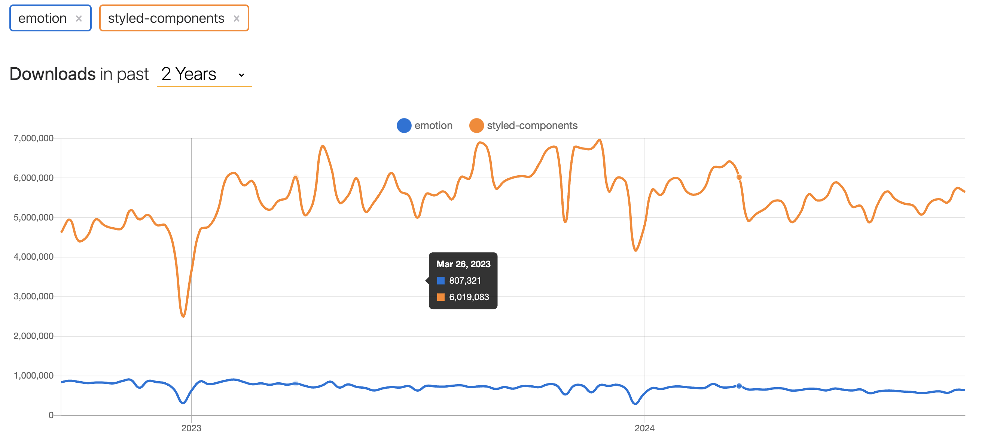

리액트를 사용하는 프론트엔드 개발자라면 styled components를 많이들 사용할 겁니다. 저또한 리액트와 함께 styled compoents를 사용해왔고, 최근에는 styled components보다 성능이 우수하고, props사용이 간편한 emotion을 많이 사용하고 있습니다.  

그동안 당연하게 사용해왔는데, 우리는 왜 CSS-in-JS를 사용하용하는지 되돌아 보면서 정리해보겠습니다.

## CSS-in-JS의 등장배경

1. 컴포넌트 기반 아키텍처의 부상:
   - React, Vue, Angular 등의 프레임워크가 컴포넌트 기반 개발을 촉진했습니다.
   - 기존의 CSS 방식은 컴포넌트의 독립성과 재사용성을 완전히 지원하기 어려웠습니다.
2. 글로벌 네임스페이스 문제:
   - 전통적인 CSS는 글로벌 네임스페이스를 사용하여 스타일 충돌 문제가 빈번했습니다.
   - 대규모 애플리케이션에서 이름 충돌을 방지하기 위한 복잡한 명명 규칙이 필요했습니다.
3. 동적 스타일링의 필요성:
   - 웹 애플리케이션이 더 동적이고 인터랙티브해지면서, 런타임에 스타일을 동적으로 변경할 필요성이 증가했습니다.
   - 기존 CSS로는 JavaScript 상태에 따른 스타일 변경이 번거로웠습니다.
4. 성능 최적화:
   - 대규모 애플리케이션에서 사용되지 않는 CSS를 제거하는 것이 어려웠습니다.
   - 필요한 스타일만 로드하여 초기 로딩 시간을 줄이고자 하는 요구가 있었습니다.
5. 유지보수성 향상:
   - CSS 파일과 JavaScript 파일을 별도로 관리하는 것이 대규모 프로젝트에서 복잡성을 증가시켰습니다.
   - 컴포넌트와 관련된 모든 코드(HTML, JS, CSS)를 한 곳에서 관리하고자 하는 욕구가 있었습니다.
6. CSS 전처리기의 한계:
   - Sass, Less 등의 CSS 전처리기가 많은 문제를 해결했지만, 여전히 동적 스타일링과 컴포넌트 격리 문제를 완전히 해결하지 못했습니다.
7. JavaScript의 강력함 활용:
   - JavaScript의 풍부한 기능과 생태계를 스타일링에도 활용하고자 하는 욕구가 있었습니다.
   - 조건문, 루프, 함수 등을 스타일링에 직접 활용할 수 있게 되었습니다.
8. 타입 안정성:
   - TypeScript의 인기가 높아지면서, CSS에도 타입 체크를 적용하고자 하는 요구가 생겼습니다.

CSS-in-JS는 이러한 문제들을 해결하기 위한 시도로 등장했습니다. 2014년 Facebook의 Christopher Chedeau(vjeux)가 "React: CSS in JS" 발표를 통해 이 개념을 소개한 이후, 다양한 CSS-in-JS 라이브러리들이 개발되어 왔습니다.

하지만 모든 라이브러리들이 요구사항을 만족하는것은 아닙니다. 그리고 전통적인 CSS로도 가능한 부분도 있습니다.

저는 컴포넌트기반 아키텍처를 사용하기 때문에 전통적인 css보다 css in js가 더욱 가독성 있고, 효율적으로 사용하게 된다고 생각합니다.

## CSS-in-JS의 단점들

등장배경에 대해 찾아보게 되면서 CSS-in-JS와 헤어지는 이유라는 글을 보게되었습니다.
https://junghan92.medium.com/%EB%B2%88%EC%97%AD-%EC%9A%B0%EB%A6%AC%EA%B0%80-css-in-js%EC%99%80-%ED%97%A4%EC%96%B4%EC%A7%80%EB%8A%94-%EC%9D%B4%EC%9C%A0-a2e726d6ace6

CSS-in-JS의 아쉬운 점은 아래와 같습니다.

1. CSS-in-JS는 런타임 오버헤드를 더합니다. 컴포넌트가 렌더링 될때 CSS-in-JS라이브러리는 document에 삽입할 수 있는 일반 css로 스타일을 직렬화 해야합니다. 이런 부분이 추가 CPU를 차지합니다.
2. CSS-in-JS는 번들 크기를 늘립니다.
   사이트 방문시 CSS-in-JS라이브러리용 자바스크립트를 다운로드 해야합니다. . Emotion은 압축되었을 때 7.9kB이고 styled-components는 12.7kB입니다.
3. CSS-in-JS를 사용하면 특히 SSR 및 혹은 또는 컴포넌트 라이브러리를 사용할 때 잘못될 수 있는 부분이 훨씬 더 많습니다. Emotion 깃헙 저장소에서 우리는 다음과 같은 수많은 이슈를 제보받습니다.

---

이런 이슈들로 인해 새롭게 등장하게된 라이브러리가 있습니다. Vanilla Extract입니다. 런타임 CSS의 경우 SSR에서 이슈가 크기때문에 컴파일 타임 CSS-in-JS라이브러리가 등장하게되었습니다.
라이브러리들의 장단점을 잘 비교해서 프로젝트에 맞는 라이브러리를 사용해야 합니다.

---

참고자료
https://ttaerrim.tistory.com/64
https://shiwoo.dev/posts/next-13-and-css-in-js
