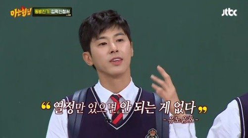

### 항해 데브톡 컨퍼런스 : 우물안 개구리 탈출하기

우선 결론 부터 말하자면
우물안 개구리 탈출하기 프로젝트에 아주 적합한 컨퍼런스였습니다.
컨퍼런스의 청자가 시니어 보다는 주니어 개발자들을 위한 주제들이어서 많이 공감하고 배울 수 있었습니다. 반면 경력이 있으신 분들께서는 레벨이 낮아서 조금 실망이라고 하기도 하였습니다.
또 좋았던 점은 네트워킹이라는 취지에 맞게 입장하자마다 네명씩 팀을 만들어서 이야기 나눌수 있는 판을 깔아주었습니다. 오히려 민망하지 않게 당연한 분위기로 네트워킹을 진행할 수 있었습니다. 덕분에 다른 개발자들과 현업이야기를 나눌 수 있었습니다.
첫 컨퍼런스라 그런지 좋은 연사자 분들과 좋은 내용들이 많았기 때문에 잊지 않기 위해 기록하고 공유해봅니다.

아래 정리 요약한 내용들은 주요하다고 생각되는 부분만 간결하게 정리하여, 정확하지 않을 수 있음을 참고해주시기바랍니다.

# 인프랩 이동욱 CTO님 : AI와 자동화로 주니어 개발자 키우기

인프랩의 팀문화부터 먼저 설명을 시작해 주셨습니다.
우선 ai와 자동화로 주니어 개발자 키우기라는 발표에 앞서 이렇게 해야하는 팀 문화와 상황을 설명해주셨습니다.
인프랩에서는 사회생활을 처음으로 시작하는 어린 개발자들을 적극채용하고 있다고 합니다.
이런 개발자들을 빠르게 훈련시키고 실무에 투입시키기 위해 다양한 노력들을 하였고 그러한 노력의 결과물을 볼 수 있었습니다.

```
1. 문서화 : 적극적인 문서화를 통해, 불필요한 소통을 줄임
2. 테스트 코드 : 테스트 코드 없이 pr이 approve되지 않음.
3. 다양한 툴을 사용한 코드리뷰 자동화:
   1. 소나큐브(정적분석)
   2. 래빗 : https://docs.coderabbit.ai/
4. 챗봇의 적용 : 문서화 , db화된 내용들을 챗봇을 통해 슬랙에서 즉문즉답 가능한 프로세스 구축(용어집, 회의록 등등 )
```

인프랩은 자랑스럽게 소개할 수 있는 좋은 문화들을 많이 가졌구나라는 생각도 들고,어떻게 이많은 것들을 구축할 수 있었을까
개발팀의 분위기가 어떨지 궁금하기도하고, 부럽기도한 시간이었습니다.
그리고 여담으로, 다른 연사자분께서 이런것들을 찾아서 하는 개발자라면 좋은개발자로 할 수 있을거 같다는 이야기도 나왔었습니다.
좋은 자극을 많이 받고, 다른 개발팀의 문화도 엿볼 수 있는 좋은 시간이었습니다.
나도 계속해서 불편함을 불평과 고민에서 끝나지 않고, 개선에 대한 고민과 실행으로 옮기자!!



---

# 테오님 : 책임 분리의 마법 - 깔끔한 폴더 구조 만들기

폴더구조에 대한 강연은 프론트엔드 개발자로서 많은 공감이 갔던 내용이었습니다.

https://velog.io/@teo/cleancode
참고로 테오님께서 작성하는 블로그의 내용과 연결되는 내용이었습니다.
우리가 우선 가독성 있는 코드를 작성하려면, 정돈된 파일구조를 유지할려면 어떻게 생각하고 고민해야할까요?
게슈탈트 법칙을 생각해보면
현대 리액트 폴더구조와
FSD 아키텍쳐에 대해 평소 알고는 있었지만, 적용 할까말까 고민되었는데, 좀더 적용해 보아야겠다는 동기부여가 되었다.
