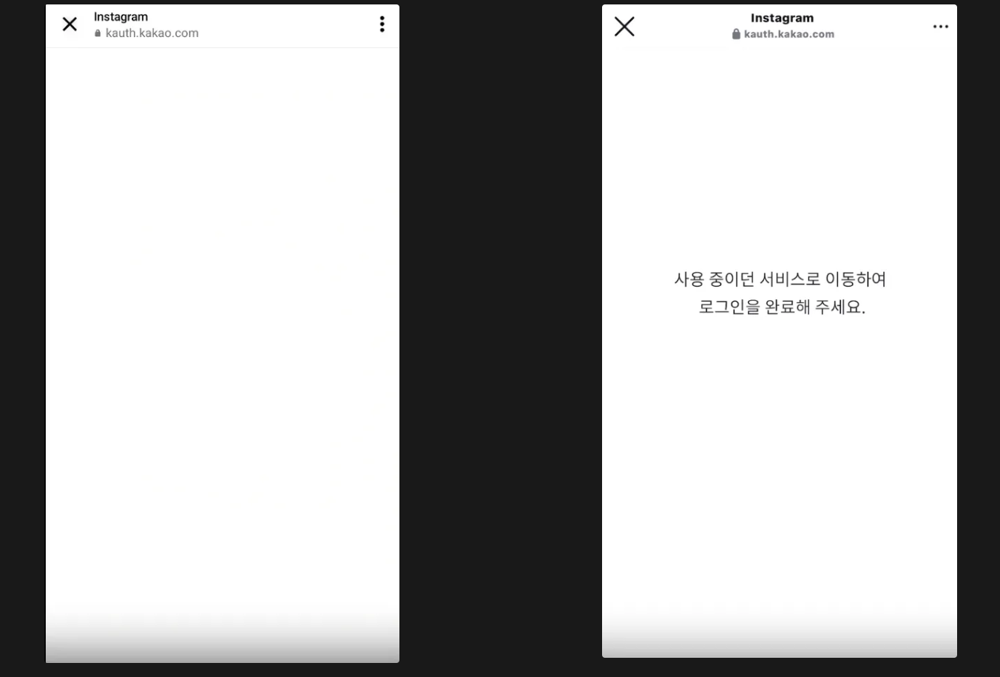

이 글은 인앱브라우저 이슈로 인해 카카오 로그인 sdk version1에서 version2로 업그레이드한 내용을 담고 있습니다. 

# 어떤 문제?

인스타그램 마케팅을 시작하였습니다. 그와 동시에 오류제보방에 올라온 이슈는 인스타그램에서 카카오 로그인이 되지 않는다는 이슈였습니다. 

로그인 시에는 하얀 화면만 노출되었으며,

회원가입시에는 자사사이트로 리다이렉트가 불가하였습니다. 




진입루트는 인스타그램 브라우저로 진입시였고, 기타 인앱 브라우저 사용시에도 간헐적으로 발생하였습니다. 

# 원인파악

해당 이슈는 크롬이나, 웹 브라우저에서는 정상작동하였으나, 인스타그램같은 인앱브라우저에서 문제를 일으키고 있어 카카오 sdk관련 이슈에 대한 정보가 많은 카카오 데브톡에서 비슷한 이슈들이 있는지 찾아보았습니다. 


역시나 비슷한 이슈들이 많이 올라와 있었고, 저희 카카오 로그인도 동일하게 팝업방식으로 사용중이고, 인스타그램은 팝업을 지원하지 않아서 발생한 이슈임을 확인 할 수 있었습니다. 

# 해결방안

제품의 지속가능성과, 정확한 문제해결을 위해 카카오에서 권장하는 방식으로 sdk v2로 마이그레이션을 진행하기로 하였습니다. 

https://developers.kakao.com/docs/latest/ko/javascript/migration

카카오 로그인에는 `sdk`방식과 `rest api` 방식이 존재합니다. 그 중에서도 저희는 sdk방식으로 진행하기로 하였습니다. 

이 두가지 방식의 큰 차이점은 sdk 방식이 카카오 어플이 바로 실행된다는 점에서 차이가 있다. rest api를 사용할 경우 서버에서 추가작업이 소요될 수 있다는 이슈가 있어 sdk방식을 선택하게 되었습니다. 

# 적용하기

## 스크립트 설정

kakao developer 문서에서 제공하는 대로 v2에 맞는 스크립트를 적용하였습니다. 

여기서 integrity는 업그레이드 버전에 대한 정보르 담고있습니다. 

```jsx
<!-- Before -->
<script src="https://t1.kakaocdn.net/kakao_js_sdk/v1/kakao.min.js"></script>

<!-- After -->
<script src="https://t1.kakaocdn.net/kakao_js_sdk/${VERSION}/kakao.min.js"
  integrity="${INTEGRITY_VALUE}" crossorigin="anonymous"></script>
```

하지만 적용후 빌드과정에서 새로운 오류를 만나게 되었습니다. 

`No sync scripts`라는 오류 만나게 되었고 next에서 발생하는 스크립트 이슈임을 알게되었습니다. nextjs에서 권장하는 대로 Next script로 변경후 beforeInteractive 옵션을 추가해 줌으로써 카카오 sdk 로딩 이슈를 해결하였습니다. 

https://nextjs.org/docs/messages/no-sync-scripts

https://web.dev/articles/efficiently-load-third-party-javascript?hl=ko

```jsx
  <Script
         src="https://t1.kakaocdn.net/kakao_js_sdk/${VERSION}/kakao.min.js"
  integrity="${INTEGRITY_VALUE}" crossorigin="anonymous"
          strategy="beforeInteractive"
        />
```

sdk v2가 잘 적용됨을 확인하고 백엔드와 본격적인 플로우 논의를 하였습니다. 

## 로그인 플로우


### 1. authorize

 authorize가 실행되면 간편로그인이 실행되고,kakao에서 제공하는 데모코드와 같이 authorize에서 redirectUri를 전송합니다.

```jsx
   //데모코드
    Kakao.Auth.authorize({
      redirectUri: 'https://developers.kakao.com/tool/demo/oauth',
    });
```

### 2. 인가코드

5번 : 이 redirectUri에 입력한 url로 인가코드를 내려줍니다.

* 이때 url은 카카오톡에 등록이 되어있어야 합니다. 

`[내 애플리케이션 > 카카오 로그인 > Redirect URI] 메뉴에 설정하신 uri를 입력하셔야 해요.`
카카오에서 로그인이 완료되고, 인가 코드가 생성되면 redirect url로 아래와 같이 이동되게 됩니다. 

```xml
https://developers.kakao.com/tool/demo/oauth?code={인가코드}
```

여기서 redirectUri를 클라언트로 받아서 code를 서버로 전송하여 로그인 하는 방식과 

redirectUri를 서버로 받아 모든 로그인 과정을 마친후 서버에서 클라이언트로 리다이렉트 시켜주는 방식을 고민하였습니다. 

하지만 카카오에서 제안하는 방식을 보면 후자를 추천하고 있습니다. (이미지 참고)

해당 플로우가 효율적이며, 보안상 안전하기 때문입니다. 

### 3. 클라이언트 리다이렉트

이후 서버에서 로그인 로직이 끝나면 클라이언트로 리다이렉트를 해주어야 합니다. 하지만 클라이언트 리다이렉트 url이 동적으로 변할 수 있기 때문에 authorize에서 state라는 파라미터를 사용하기로 하였습니다. state 파라미터로 리다이렉트를 해주기로 백엔드와 논의하였습니다. 

```tsx
    Kakao.Auth.authorize({
      redirectUri: 'https://developers.kakao.com/tool/demo/oauth',
      state: 클라이언트 리다이렉트 url 
    });
```

### 4. 토큰 전송 해당 url에

쿠키를 http-only cookie 에 담아서 전송 

이부분이 가장 시행 착오가 많았습니다. 아무래도 쿠키에 대한 정확한 정책확인 없이 작업을 진행하여 그런것 같습니다. 

https://velog.io/@hjch0211/Apis-redirect%EC%97%90-cookie%EB%A5%BC-%EB%8B%B4%EC%95%84%EB%B3%B4%EC%95%84%EC%9A%94-%EC%8B%A4%ED%97%98

딱 저희와 같은 상황이라서 많은 도움을 받을 수 있었습니다. 

서버에서 보내준 쿠키와 함께 로그인 플로우가 완성되었습니다.