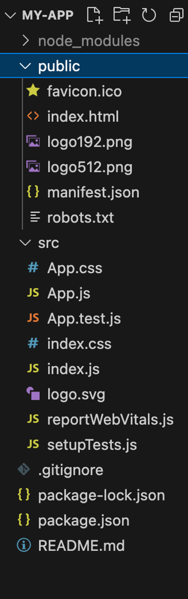
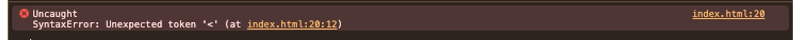
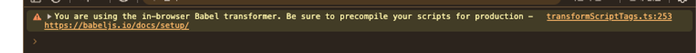
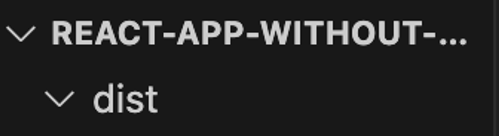
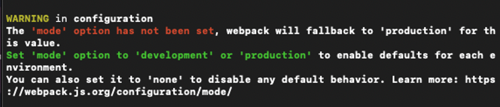

요즘 리액트를 쓸줄만 아는 사람에서 리액트를 잘 아는 사람이 되기 위해 공부중입니다.

그래서 시작하게된 CRA를 직접 만들어보면서 develop해보기로 하였습니다.

cra를 직접 구현하는 과정은 유투브와, webpack, babel문서를 주로 참고하였습니다.

---

첫 시작은 어떻게 해야할까요.
우선 CRA를 했을때 파일 구조를 참고하였습니다.



여기서 가장 먼저 본체를 담당하는 index.html부터 만들어보려고 합니다.

### index.html 만들기

react / reactDOM 패키지 CDN 통해 로드하기 https://unpkg.com/

(install하지 않고 cdn을 사용한 이유는 가벼운 설정과, 웹팩을 적용시키는데 목적을 두어 리액트는 cdn으로 사용하게 되었습니다. )

```jsx
<script src="https://unpkg.com/react@18.3.1/umd/react.production.min.js"></script>
```

빠르게 리액트를 가져온뒤 루트를 렌더시켜 줍니다.

### 리액트 돔 렌더

```html
<script>
	const App = () => React.createElement("h1", null, "HELLO WORLD");
	const root = ReactDOM.createRoot(document.getElementById("root"));
	root.render(
		<React.StrictMode>
			<App />
		</React.StrictMode>
	);
</script>
```

하지만 CRA에서 보았던 것처럼 render시켜줄 경우 위와같은 문제가 발생합니다.



에러메시지를 확인하니, jsx 문법을 읽지 못하는 에러이므로, jsx문법을 제거해줍니다.

```jsx
<script>
	const App = () => React.createElement("h1", null, "HELLO WORLD");
	ReactDOM.render( React.createElement(App), document.getElementById("root") );
</script>
```

이제 오류없이 화면이 뜨는걸 볼 수 있습니다.


이제 본격적으로 jsx문법을 사용할 수 있도록 만들어보겠습니다.

이럴때 필요한 것이 트랜스파일러입니다.

- 트랜스파일러 : 문법 변환도구 + 다른 언어를 변경
  트랜스파일링은 특정 언어로 작성된 코드를 비슷한 다른 언어로 변환시키는 행위를 말합니다.
  ex) typescript → javascript / jsx → javascript
  최근 이렇게 리액트, 뷰, 타입스크립트 같이 문법적으로 변환시켜야 하는 서드파티가 필수적으로 사용하게 되면서 트랜스파일링에 대한 필요성이 대두되었습니다.
  대표적인 트랜스파일러는 바벨은 es6코드를, 이를 es5이하 코드 버전으로 변환시키기 위해 처음 등장하게 되었습니다.
- babel이 하는일
  폴리필 기능, 소스코드 변환,

### JSX 문법 사용하기 : 트랜스파일러 (babel)

바벨 또한 경량화와 기능테스트를 위해 babel standalone을 cdn으로 가져왔습니다.

```jsx
<script src="https://unpkg.com/@babel/standalone@7.25.6/babel.min.js"></script>
```

babel로 transpile을 명령해 주는 구문을 script에 추가하였습니다.

```jsx
<script type="text/babel">
	const App = () => <h1>Hello World</h1>; ReactDOM.render(
	<App />, document.getElementById("root"));
</script>
```

바벨을 적용후 jsx실행이 잘되는것을 확인할 수 있었습니다.


그러나, 새로운 경고메시지를 만났습니다. 저는 이부분이 이해하기 어려웠습니다.



브라우저에서 babel을 실행하는것은 babel로 파일을사전 컴파일 하는것보다 느리기 때문에. 프로덕션 사이트에서 브라우저에서 babel을 실행하면 안된다는 것을 알려주는 경고메시지 입니다.

이는 브라우저가 페이지를 열 때마다 파일을 컴파일 해야 하기 때문입니다.

그래서 미리 트랜스 파일된 스크립트 파일 실행하도록 해주어보겠습니다.

### webpack : 빌드타임에서 스크립트 실행하기.

바벨 패키지 다운로드를 통해 빌드타임에서 스크립트를 실행하도록 변경해보겠습니다.

- babel/cli : script 명령어를 통해 babel을 실행하기 위한 패키지
- babel/core : script 명령어를 통해 babel을 실행하기 위한 패키지
- babel/preset-react :react문법을 javascript로 트랜스파일 하기 위한 패키지

+node modules gitignore에 추가해줍니다.

.babelrc에 preset 정보넣기

```jsx
{
	"presets": ["@babel/preset-react"]
}
```

이제 빌드시 트랜스파일되도록 빌드 스크립트를 작성해줍니다.

### 빌드스크립트 작성

```jsx

{
	"scripts": {
		"build": "babel src --out-dir dist" //src폴더를 babel로 트랜스파일하여, dist 폴더에 저장
	},
	"devDependencies": {
		"@babel/cli": "^7.25.6",
		"@babel/core": "^7.25.2",
		"@babel/preset-react": "^7.24.7"
	}
}

```

build 실행시 dist 폴더가 생성됩니다.

```jsx
npm build
```



스크립트를 변경하여 만들어진 dist 파일을 실행하도록 하였습니다.

```html
<body>
	<div id="root"></div>
	<script src="dist/app.js"></script>
</body>
```

하지만, 트랜스 파일된 파일이 여러개가 된다면 app.js만으로 가능할까요?

그래서 필요한 것이 번들러입니다.

### 번들러와 바벨

번들러 : 간단히 말해 여러개의 파일을 하나로 묶어줍니다. 대표적으로 webpack, parcel, rollup등이 있습니다.

번들링이 필요한 이유 : 이전에는 각 파일마다 서버에 요청하여 자원을 받아와야 했습니다. 하지만 파일을 묶어서 응답을 받기 때문에 네트워크 적으로 비용이 줄게됩니다. 또한, 번들러를 사용하면 모듈 단위 개발이 가능해집니다.

패키지를 다운로드 해줍니다.

- webpack
- webpack-cli
- babel-loader

webpack.config.js를 작성해줍니다.

(node 환경에서 실행됨. )

```jsx
module.exports = {
	entry: "./src/app.js", //번들링의 시작점 계산
	output: {
		path: path.resolve(__dirname, "dist"), // 번들링된 파일이 저장될 경로
		filename: "bundle.js", // 번들링된 파일의 이름
	},
	module: {
		rules: [
			{
				test: /\.js$/, //파일 확장자 별로 처리
				exclude: /node_modules/,
				use: {
					loader: "babel-loader",
				},
			},
		],
	},
};
```

script를 변경하고, 번들을 실행하도록 해줍니다.

```jsx
<script src="dist/bundle.js" type="module"></script>
```

```jsx
		"build": "webpack"
```

덕분에 스크립트 파일로드가 줄게되었습니다.

하지만 warning 발생합니다.



production과 development의 빌드타임이 달라 웹팩 실행모드를 설정해 달라는 메시지 입니다. 프로덕션 모드에는 최적화 기법이 자동 적용되기 때문에 실행모드를 설정해주어야 합니다.

- 이로 발생했던 이슈
  react element name

```jsx
const path = require("path");
module.exports = {
	entry: "./src/app.js", //번들링의 시작점 계산
	output: {
		path: path.resolve(__dirname, "dist"), // 번들링된 파일이 저장될 경로
		filename: "bundle.js", // 번들링된 파일의 이름
	},
	module: {
		rules: [
			{
				test: /\.js$/, //파일 확장자 별로 처리
				exclude: /node_modules/,
				use: {
					loader: "babel-loader",
				},
			},
		],
	},
	mode: "development", // dev로 설정
};
```

이제 기본설정이 끝났으니, 프로그램을 원활하게 운영할 수 있는 플러그인들을 설치해줍니다.

## 추가 플러그인 설치하기

plugin : 빌드 프로세스의 특정 시점에 후킹되어 추가 기능을 수행하는 확장 모듈입니다.

html-webpack-plugin : webpack 번들을 제공하는 html 파일 생성을 단순화 해줍니다. 사용시 매번 컴파일에 변경되는 해시로된 파일 이름을 가진 webpack번들에 특히 유용합니다.

clean-webpack-plugin :

webpack-dev-server: 개발서버 적용.

webpack-dotenv : env를 development, production, staging 환경별로 적용시켜주는 플러그인.

cross-env :

---

여기까지 오면서 기존 CRA에는 어떤 기본 설정들이 들어가 있었고, 이런 설정들을 어떻게 추가해주면 되는지 직접 만들어보면서 알 수 있었습니다. 그리고 웹팩이 어떤 작업들을 도와주는 지도 알 수 있었습니다.

---

최근에는 cra보다 vite를 더 많이 사용하고 있습니다.

# vite가 CRA보다 뜨는 이유

vite가 cra보다 뜨는 이유는 대표적으로 ‘빠르다’ 인데요. 디테일한 차이는 아래와 같습니다.

- 모듈 번들링
  - vite: 개발모드에서는 ES모듈 사용. 브라우저에서 직접 모듈 로드 .
  - cra : 개발서버 시작시 모든 모듈을 한번에 변환
- 빌드
  - vite: rollup 사용 - 가능한 작은 번들로 만들기 위해 tree shaking 활용. 개발모드에서는 모듈을 동적으로 변환하고, 빌드시에만 rollup사용. 개발과정에서 빠른 HMR제공. 빌드시에는 효율적인 번들생성.
  - cra: webpack
- cra 웹팩 설정 변경의 어려움 : 내부적으로 웹팩설정을 감추고 있어 변경하려면 eject과정이 필요. ( 특정 파일 형식에 대한 로더 설정변경, 플러그인 추가, 번들링 최적화 설정 변경, )
- babel, eslint 설정 변경 : cra는 airbnb의 eslint를 기본적으로 사용.

---

이제 차이를 알았으니, 현재의 cra기반 세팅에서 빠르고 성능최적화를 반영하여 개선해 보겠습니다.
