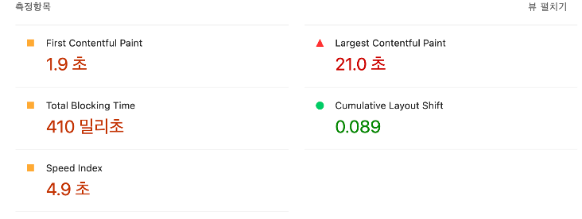

**3개월간** 빠른 개발 프로세스를 진행하며 실험과 개선을 반복한 결과, **20개의 새로운 기능**이 추가되었습니다. 하지만 이는 **무거워진 프로젝트**라는 기술 부채를 안겨주었습니다. 웹뷰 기반으로 만들어져 있어 기본 브라우저에서 사용하는 것보다 성능이 아쉬웠고, 앱스토어에 올라온 악플을 보고 더 이상 미룰 수 없다는 생각에 **코드 다이어트**를 시작하게 되었습니다.


---

## 1. 진단: LCP Breakdown 읽기

우선 Chrome Lighthouse로 현재 상태를 봤습니다.




LCP와 CLS 모두 개선이 필요한 상태였습니다.

LCP는 단순히 "화면이 느리다"는 숫자가 아니라 **어디서 시간이 쓰였는지** 4단계로 쪼개서 볼 수 있습니다.

| 단계 | 의미 |
|---|---|
| **TTFB** | 요청 후 서버에서 첫 번째 바이트가 도착하기까지 |
| **Resource load delay** | TTFB 이후 브라우저가 LCP 리소스 요청을 시작하기까지 |
| **Resource load duration** | LCP 리소스 실제 다운로드 시간 |
| **Element render delay** | 리소스 로드 완료 후 화면에 그려지기까지 |


```
Time to first byte (TTFB): 137ms (41.6%)
Resource load delay: 102ms (30.8%)
Element render delay: 91ms (27.6%)
Resource load duration: 0.1ms (0.0%)
```

여기서 눈에 띄는 건 **Resource load duration이 0.1ms**라는 점입니다. 이미지 자체의 다운로드는 거의 순식간인데, 요청 시작이 102ms나 걸리고 있다는 뜻입니다.

LCP 요소를 확인해보니 캐러셀 썸네일 이미지였습니다.


→ 이미지를 더 빨리 다운로드하는 게 아니라, **더 일찍 요청**하는 게 핵심이었습니다.

---

## 2. 이미지 최적화

`loading` 속성을 지정하지 않으면 브라우저는 뷰포트 밖 이미지도 포함해서 페이지 진입 시 모두 요청합니다. 이 이미지들이 네트워크를 선점하면 LCP 이미지의 요청이 뒤로 밀립니다. 이게 Resource load delay가 길었던 이유였습니다.

```jsx
// Before: 모든 이미지가 즉시 로딩


// After: 뷰포트에 진입할 때만 로딩

```

홈 캐러셀 영역에서 첫 화면에 보이지 않는 이미지들에 `loading="lazy"`와 `fetchPriority="low"`를 추가해줬습니다.


---

## 3. Dynamic Import

### 번들러가 import를 처리하는 방식

최적화 전 홈 페이지의 빌드 결과입니다.

```
ƒ /    20.9 kB    338 kB
```

루트 레이아웃에서 로그인 모달, 프로모션 모달 등을 정적으로 import하고 있었습니다.

```jsx
// Before: 모든 모달이 초기 번들에 포함
<div className={cn(responsive.container, 'relative')}>
  {children}
  <LoginModal />
  <ShopAtpisodeLoginModal />
  <PromotionTermsModal />
</div>
<SonnerToaster />
<ChristmasGiftModalProvider />
```

webpack은 빌드 시 import 구문을 정적으로 분석해서 연결된 모듈들을 하나의 청크로 묶습니다. 정적으로 import된 모달은 화면에 보이든 아니든 홈 청크에 포함됩니다.

`dynamic()`을 쓰면 번들러가 해당 모듈을 **별도 청크**로 분리하고, 컴포넌트가 실제로 렌더링될 때 그 청크를 요청합니다.

### `ssr: false`가 하는 일

`ssr: false` 없이 dynamic import만 하면 서버에서 해당 컴포넌트를 렌더링하려고 시도합니다. 모달처럼 초기 HTML에 필요 없는 컴포넌트는 SSR 단계에서 렌더링해도 의미가 없고, hydration 시 서버 HTML과 클라이언트 결과를 비교하는 과정이 추가로 생깁니다.

`ssr: false`를 지정하면 SSR 단계를 완전히 건너뛰고 클라이언트에서만 마운트됩니다.

```jsx
// After: 필요할 때만 로딩
const SonnerToaster = dynamic(() => import('@/providers/SonnerProvider'), {
  ssr: false,
});

const LoginModal = dynamic(() => import('@/components/modals/login-modal'), {
  ssr: false,
});

const ShopAtpisodeLoginModal = dynamic(
  () => import('@/components/modals/shop-atpisode-login-modal'),
  { ssr: false },
);

const PromotionTermsModal = dynamic(
  () => import('@/components/modals/promotion-terms.modal'),
  { ssr: false },
);
```

```
Before: ƒ /    20.9 kB    338 kB
After:  ƒ /    18.5 kB    337 kB
```

페이지 크기는 2.4KB 줄었지만 first load는 338KB → 337KB로 1KB밖에 안 줄었습니다. 모달 청크는 여전히 다운로드되기 때문입니다. 다른 점은 **타이밍**입니다. 초기 렌더링에 필요한 JS가 먼저 실행되고, 모달 청크는 실제로 필요할 때 로드됩니다.

---

## 4. heic2any: 공유 청크 문제

### 어디서 오는 크기인가

bundle analyzer로 페이지별 번들 구성을 분석했더니 `heic2any`가 큰 비중을 차지하고 있었습니다.


```
ƒ /popup/[id]    121 kB    372 kB
```

같은 고민을 하는 사람들이 많더라구요.

Next.js는 여러 페이지에서 공통으로 사용하는 모듈을 **shared chunk**로 분리합니다. 루트 레이아웃에서 import하면 shared chunk에 포함되고, 이게 모든 페이지의 first load에 붙습니다. 실제로 heic 변환이 필요한 곳은 이미지 업로드 페이지 하나뿐이었는데 전체 앱에 딸려 다니고 있었던 겁니다.

- size는 줄었지만 first load는 오히려 증가하였습니다. 그래서 스크립트를 루트 레이아웃에서 import 하는 것이 아닌 사용하는 페이지에서 동적 import 하는 방식으로 변경하였습니다.

```jsx
// Before: 전역 레이아웃에서 import
import { heic2any } from 'heic2any';

// After: 사용하는 페이지에서만 동적 로딩
<Script 
  src="heic2any.js" 
  loading="lazy"
  fetchPriority="low"
/>
```

이와 함께 팝업 상세 페이지에서 관련 팝업 컴포넌트, 지도 컴포넌트를 dynamic import로 전환하고 리뷰 관련 prefetch도 제거했습니다.

```
Before: ƒ /popup/[id]    121 kB    372 kB
After:  ƒ /popup/[id]    38.5 kB   359 kB
```

**팝업 상세 페이지 121KB → 38.5KB (68% 감소)**. 이 수치는 heic2any 제거 단독 결과가 아니라 dynamic import + prefetch 제거 + Script 교체의 복합 결과입니다.


---

## 5. Fetch 호출 줄이기

### 왜 Fetch 최소화가 중요한가?

**저속 네트워크 환경**(3G/LTE, 해외, WebView)에서 체감 **로딩 속도** 개선이 중요합니다. 또한 **RSC payload** 감소, **hydration payload** 감소로 **초기 paint 안정성**을 높일 수 있습니다.

- 첫 화면에 필요한 것만 즉시 렌더
- 나머지는 lazy

**as-is**


**to-be**


1. **투표 API**: `inView` 시에만 호출
2. **최신 정보 API**: `useQueries`로 묶어서 병렬 처리
3. **인증 상태**: `isAuthenticated` 옵션 추가

팝업 리스트, 상세 페이지에서는 불필요한 prefetch를 제거하고 하단 추천 API들은 스크롤 시에만 호출하도록 변경했습니다.

**JS 청크 개수**도 **56개**로 감소했습니다.

---

## 6. 런타임 성능

### CPU 4× 기준 분석

빌드 번들을 줄인 뒤 Performance 탭에서 CPU 4× 감속 조건으로 런타임을 분석했습니다.


```
Loading:    16ms
Scripting:  3,927ms
Rendering:  1,222ms
Painting:   535ms
```

네트워크는 문제가 없었습니다(Loading 16ms). 병목은 **Scripting**이었습니다. 프레임 타임이 2,000ms를 넘는 구간이 반복되고 있었습니다.

> 60fps 기준 한 프레임은 16ms 안에 끝나야 합니다. 수천 ms 동안 메인 스레드가 점유되면 스크롤이 "움직이지만 손에 안 붙는 느낌"이 됩니다.

### LCP/CLS/INP가 괜찮은데 체감이 안 좋은 이유

LCP는 초기 렌더링 1회만 측정하고, INP도 대표 상호작용 1회가 기준입니다. 무한 스크롤, 리스트 이미지 로딩, analytics 이벤트, IntersectionObserver 콜백이 계속 메인 스레드를 사용하는 구조는 Core Web Vitals로 잡히지 않습니다.

Performance 탭 Insights에서 나온 경고들:
- Optimize DOM size
- Improve image delivery (26MB)
- Use efficient cache lifetimes (21MB)

이 부분은 추가 개선이 필요한 영역으로 남아 있습니다.

---

## 개선 성과 요약

| 항목 | Before | After |
|---|---|---|
| 홈 페이지 크기 | 20.9 kB | 17.9 kB |
| 팝업 상세 페이지 | 121 kB | **38.5 kB (68% ↓)** |
| 홈 first load | 338 kB | 340 kB (+2kB) |
| JS 청크 수 | — | 56개 감소 |

홈 first load가 소폭 증가한 건 heic2any를 Script 태그로 교체하는 과정에서 스크립트 위치가 바뀌면서 생긴 변화입니다. 개별 페이지 번들은 줄었지만 first load 합계가 오를 수 있다는 점을 이번에 직접 확인했습니다.

---

## 참고하면 좋은 글

- [우아한형제들 기술블로그 - Next.js 성능 최적화 경험기](https://techblog.woowahan.com/20228/)
- [Chrome DevTools - Performance 패널 가이드](https://developer.chrome.com/docs/devtools/performance?hl=ko)
