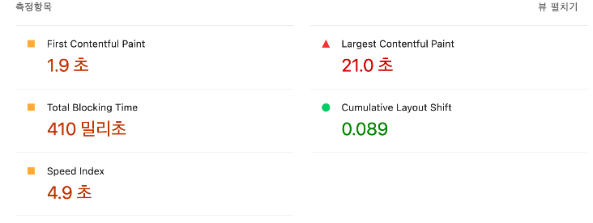

웹 프론트 개발자라면 path variable과 query parameter중 어떤걸 사용할지 고민해 본 적 있으신가요?

저도 고민을 한 적이 있는데요, 결국 특별한 기준없이 느낌가는대로 사용했던..기억이 있습니다. 그런 저의 과거를 반성하며, 자세히 알아보겠습니다.

# TL;DR

path variable와 query parameter는 URL에 데이터를 전달하는 두가지 방법입니다. 사용목적에 따라 올바르게 사용해야합니다.

Query parameter는 필터링, 정렬, 페이지네이션, 검색등의 선택적인 정보를 전달 할 경우에서 활용합니다.

Path Variable은 리소스를 고유하게 식별할때, 고유한 id를 표현할 때 사용합니다.

# Query Parameter

**Query Parameter**는 **URL의 끝 부분**에 추가되는 변수로, URL 경로 뒤에 `?`로 시작하여 `key=value` 쌍의 형태로 전달됩니다. 여러 파라미터는 `&`로 구분됩니다. 예를 들어, `https://example.com/search?query=react&page=2`에서 `query`와 `page`는 쿼리 파라미터입니다.

```jsx
/users?id=123
```

- 쿼리 파라미터는 선택적인 데이터를 전달하는데 주로 사용됩니다.
- 필터링, 정렬, 페이징 등과 같은 옵션 데이터를 전달할 때 사용합니다.
- url에 명시적으로 나타나기 때문에 복잡한 검색조건이나, 필터링 조건 등을 쉽게 표현할 수 있습니다.
- 검색 엔진이 쿼리 파라미터를 이해하고 크롤링할 수는 있지만, SEO 측면에서 경로 변수를 사용하는 것보다는 의미가 약해질 수 있습니다.

# Path Variable

URL경로에 포함된 변수입니다.

경로 변수는 주로 리소스의 고유 식별자(사용자id, 상품id)를 나타낼 때 사용합니다.

```jsx
/users/123
```

- 경로 자체의 일부기 때문에, 필수적인 값일때 사용합니다.
- **RESTful** 스타일의 API에서 자주 사용됩니다. 예를 들어, `GET /users/123`은 사용자 123에 대한 정보를 가져오는 요청입니다.
- **검색 엔진 최적화(SEO)** 측면에서 경로 변수가 포함된 URL은 보다 직관적이고 의미 있는 URL을 제공하여 SEO에 긍정적일 수 있습니다.
- 리소스의 **계층적 구조**를 표현할 때 경로 변수는 매우 유용합니다. 예를 들어, `/users/123/posts/456`은 사용자 123의 게시물 456을 가리키는 URL입니다.

# 그래서 둘중에 어떤걸 써야할까요?



- **Path Variables**는 리소스를 고유하게 식별할 때, 예를 들어 특정 사용자, 게시물, 상품 등의 고유 ID를 표현할 때 사용합니다.
- **Query Parameters**는 필터링, 정렬, 페이징과 같이 선택적 정보를 전달할 때 사용합니다. 서버에서 제공하는 데이터에 추가적인 요청 조건을 설정하는 것이 주목적입니다.

# 번외 > Array와 Map Parameter

array를 나타내는 방식에는 다양한 방식이 있습니다.

1. 대괄호 방식

저희는 최근에 이런 형식의 array parameter를 구현하고 있습니다. key값 끝에는 []가 붙고, 반복된 키값이 있을경우 &선택자로 추가해주는 방식입니다.

왜? 이렇게 사용했냐는 질문에 대답하지 못했습니다.

올바르게 사용한 방식임에도 말이죠 ㅠㅠ

```jsx
/authors?name[]=colleen&name[]=hoover
```

- key에 `[]` 를 나타내므로 배열 형태를 명확하게 표현할 수 있습니다. 서버 프레임워크에서 일반적을 사용되는 방식입니다.

1. 반복된 파라미터 이름 사용

```jsx
/authors?name=colleen&name=hoover
```

- 이 방식은 **RFC 3986**에 따른 표준 방식 중 하나로, 동일한 파라미터 이름을 여러 번 사용할 수 있습니다. 여러 값이 하나의 파라미터에 대응할 때 자주 사용됩니다.
- 배열이 아닌 단일 값을 처리하는 서버에서는 마지막 값만 사용하거나 중복된 값을 덮어쓸 가능성이 있어, 개발자가 이를 명시적으로 처리해야 할 수 있습니다

1. 쉼표로 구분된 값 사용

```jsx
/authors?name=colleen,hoover
```

- 파라미터 값에 쉼표를 사용하여 여러 값을 구분하는 방식은 **URL이 깔끔**해지고, 배열의 시맨틱을 전달하는 것이 쉬워집니다. 이 방식은 더 직관적일 수 있습니다.
- 쉼표를 사용한 값 구분 방식은 **일부 서버 구현에서 표준 방식으로 지원되지 않을** 수 있으며, 서버가 이러한 형식을 해석할 수 있도록 추가 처리가 필요할 수 있습니다.

1. URL 인코딩 방식

```jsx
/authors?name=%5Bcolleen%2Choover%5D
```

- **URL 인코딩**을 사용하여 안전하게 배열을 전달할 수 있습니다. 모든 문자는 인코딩되어 전송되므로, 특수 문자가 포함된 데이터를 전달하는 데 적합합니다.
- **가독성**이 떨어지고, 디버깅이 어려울 수 있습니다. 또한 인코딩된 데이터를 서버 측에서 적절히 해석해야 하므로 추가 로직이 필요할 수 있습니다

이중에서 가장 표준적인 방식은 반복된 파라미터 이름을 사용하는 방식입니다. 대부분의 서버와 클라이언트에서 잘 지원되며, 웹표준에 더. 가까운 방식입니다. 특정 프레임워크에서는 배열 표현을 위한 대괄호 방식이 유용할 수도 있습니다.

---

참고자료

https://medium.com/@fullsour/when-should-you-use-path-variable-and-query-parameter-a346790e8a6d

https://dev.to/farhatsharifh/path-vs-query-parameters-choosing-the-right-approach-for-api-requests-2lah

https://www.atatus.com/blog/rest-api-best-practices-for-parameter-and-query-string-usage/
