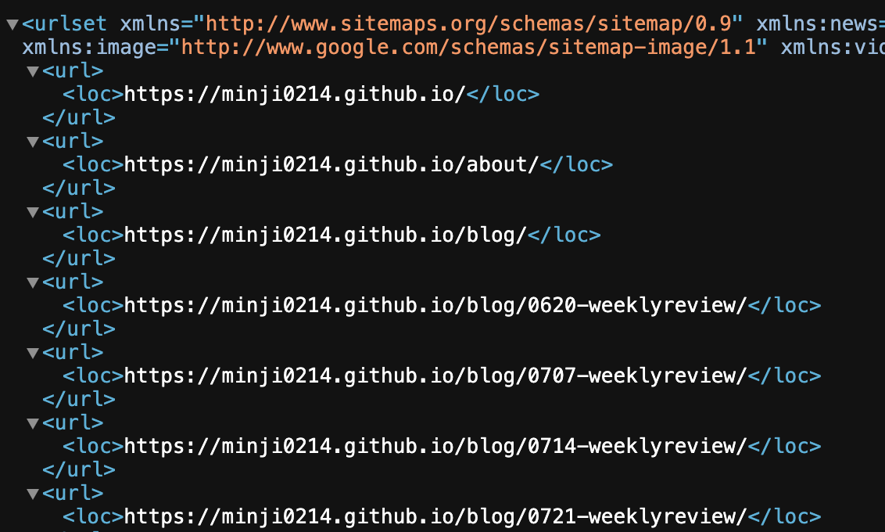
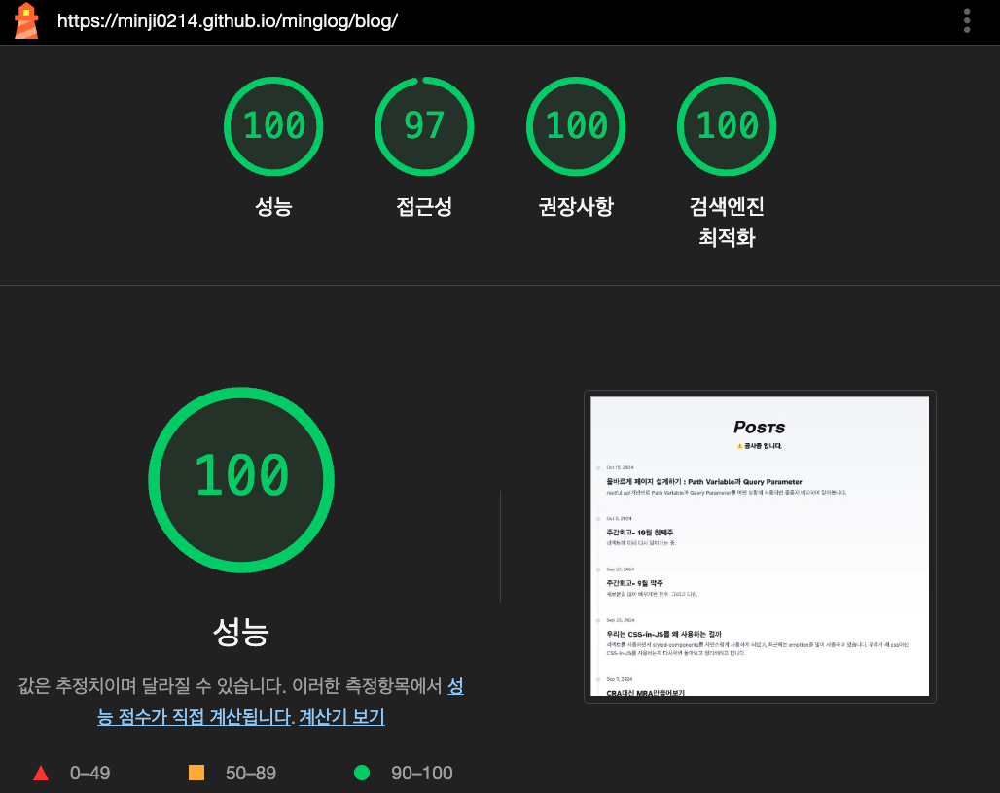
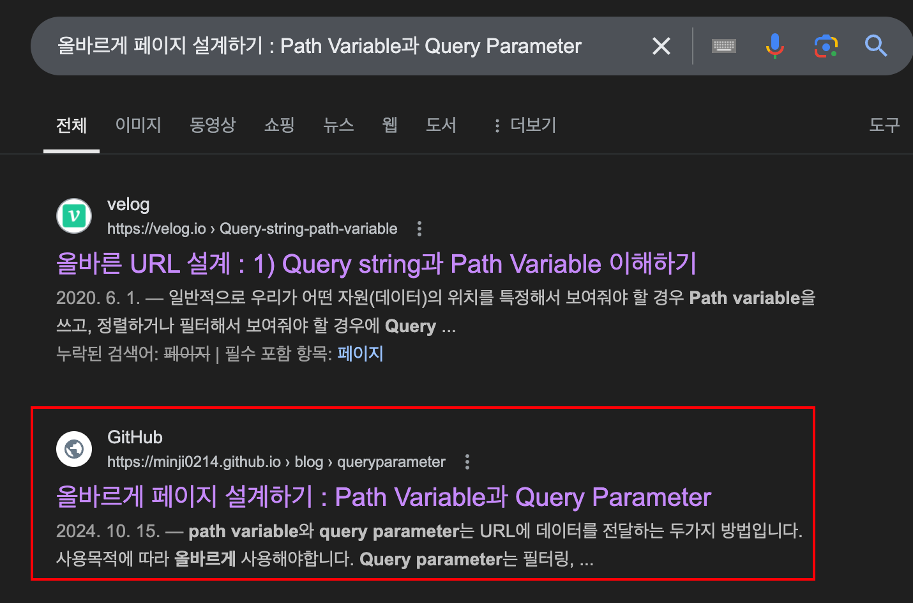
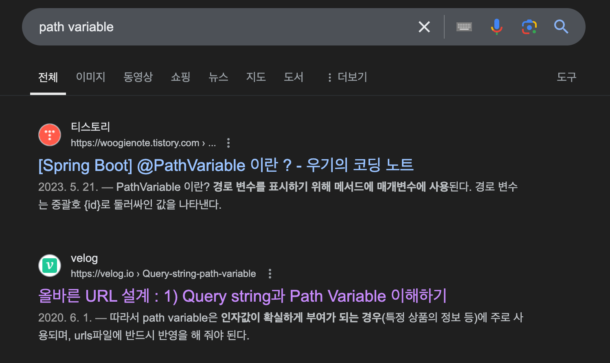
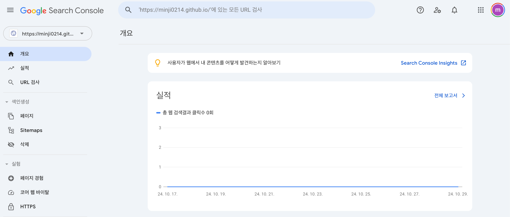

# 1. SEO에 대하여

SEO검색엔진 최적화를 의미합니다.

**웹페이지를 검색 엔진에서 더 높은 순위로 표시되게 하여 검색 결과를 통한 방문자 수를 증가시키는 기술입니다.**

**검색엔진 최적화는 세 가지의 과정으로 나뉩니다.**

- 크롤링 : 검색엔진의 크롤러(봇)가 인터넷을 탐색하여 웹사이트의 콘텐츠(텍스트, 이미지)를 찾아내고 기록(인덱싱)합니다. 이 과정에서 크롤러 봇이 사이트를 잘 읽을 수 있도록 하기위해 서버사이드 렌더링과, meta설정이 필요합니다.
- 인덱싱 : 크롤러가 발견한 콘텐츠를 검색 엔진의 데이터베이스에 저장하는 과정입니다. 이 데이터는 검색 쿼리가 발생했을 때 검색 결과로 나타날 수 있습니다.
- 랭킹 : 사용자의 검색 쿼리에 가장 관련성이 높은 웹 페이지를 결정하고 순위를 매겨 검색 결과 페이지에 표시합니다. 이 과정에서 다양한 알고리즘과 기준이 적용됩니다.

다음은 SEO에 중요한 요소들 입니다.

### 1. 키워드

- **키워드 연구**: 특정 키워드에 대한 사용자의 검색 빈도와 경쟁 정도를 파악하고, 해당 키워드를 적절하게 웹 페이지에 배치하는 것이 중요합니다.
- **키워드 최적화**: 제목, 메타 태그, 내용의 키워드 배치가 자연스럽고, 검색 쿼리와 일치하게 조정합니다.

### 2. 콘텐츠 품질

- **유용성**: 콘텐츠는 명확하고, 정보적이며, 사용자의 질문에 답을 제공해야 합니다.
- **독창성**: 고유하고 원본인 콘텐츠가 더 높은 평가를 받을 수 있습니다.

### 3. 사용자 경험(UX)

- **사이트 속도**: 빠르게 로딩되는 페이지가 사용자 경험을 개선하고 SEO에 긍정적인 영향을 미칩니다.
- **모바일 친화성**: 모바일 기기에서도 웹사이트가 잘 작동해야 합니다.

### 4. 백링크

- **품질**: 다른 관련성 높고 권위 있는 사이트로부터의 링크는 웹사이트의 신뢰도와 순위를 높이는 데 매우 중요합니다.

### 5. 기술적 SEO

- **메타 태그 최적화**: 각 페이지의 메타 태그(제목, 설명)를 적절히 작성하여 클릭률을 높입니다.
- **구조적 데이터**: JSON-LD와 같은 스키마 마크업을 사용하여 검색 엔진이 콘텐츠를 쉽게 파악할 수 있도록 합니다.

꽤나 많은 부분들이 고려되어야 합니다.


이제 검색엔진 최적화를 위해 필요한 요소들을 알아보았으니 직접 이 요소들을 만들어 나가보도록 하겠습니다.

저는 astro라는 프레임 워크를 기반으로 블로그를 만들었기 때문에 astro docs를 참고하여 적용하였습니다.

---

# 2. 나의 사이트를 크롤러가 잘 읽을 수 있도록 만들기

우리는 클롤러 봇이 코등상에서 우리 사이트의 구조를 잘 파악하고, 어떤 사이트인지 알 수 있도록 해야합니다.

- robot.txt 파일 : 이 파일은 검색 엔진 크롤러에게 웹사이트의 어느 부분을 크롤링하거나 크롤링하지 말아야 하는지 알려줍니다. 검색엔진에 노출되지 않아야 할 페이지가 있다면 robot.txt파일에서 설정해 줄 수 있습니다.

  저는 모든 사이트의 크롤링을 허용하기 때문에 아래와 같이 설정하였습니다. 구문에 대한 자세한 설명은 https://developers.google.com/search/docs/crawling-indexing/robots/create-robots-txt?hl=ko 여기서 확인할 수 있습니다.

  ```jsx
  # 모든 봇이 사이트를 스캔하고 색인을 생성하도록 허용.
  # 전체 구문: https://developers.google.com/search/docs/advanced/robots/create-robots-txt
  User-agent: *
  Allow: /
  ```

- 메타 태그 최적화 : 페이지의 제목, 설명, 키워드 등을 명확하고 효과적으로 설정하여 검색 결과에서 사용자와 크롤러의 이해를 돕습니다.
  저는 아래와 같이 head에 meta tag를 설정하였습니다. meta tag는 property와 name에 따라 각각의 역할이 다릅니다.

  ```jsx
  <!-- Primary Meta Tags -->
  <title>{title}</title>
  <meta name="title" content={title} />
  <meta name="description" content={description} />
  <meta name="keywords" content={keywords} />

  <!-- Open Graph / Facebook -->
  <meta property="og:type" content="website" />
  <meta property="og:url" content={Astro.url} />
  <meta property="og:title" content={title} />
  <meta property="og:description" content={description} />
  <meta property="og:image" content={new URL(image, Astro.url)} />

  <!-- Twitter -->
  <meta property="twitter:card" content="summary_large_image" />
  <meta property="twitter:url" content={Astro.url} />
  <meta property="twitter:title" content={title} />
  <meta property="twitter:description" content={description} />
  <meta property="twitter:image" content={new URL(image, Astro.url)} />

  ```

  ### **`name` 속성**

  **`name`** 속성은 페이지에 관한 정보를 검색 엔진이나 브라우저에 제공할 때 사용됩니다. 이는 주로 문서 레벨의 메타데이터에 사용되며, 검색 엔진 최적화(SEO)에 직접적인 영향을 미칩니다. 주로 다음과 같은 정보를 포함합니다:

  - **description**: 페이지의 간단한 설명을 제공하며, 검색 결과에서 설명 텍스트로 사용될 수 있습니다.
  - **keywords**: 페이지와 관련된 키워드를 쉼표로 구분하여 나열합니다. 과거에는 SEO에서 중요한 요소였지만, 현재는 검색 알고리즘이 훨씬 복잡해지면서 그 중요성이 감소했습니다.
  - **robots**: 검색 엔진 크롤러가 페이지를 인덱싱하거나 링크를 따르는 것을 제어합니다 (예: **`noindex`**, **`nofollow`**).

  ### **`property` 속성**

  **`property`** 속성은 주로 Open Graph 프로토콜을 사용하여 페이지의 정보를 소셜 미디어 등의 플랫폼에서 어떻게 보여질지 제어하기 위해 사용됩니다. 이는 소셜 미디어 카드에 사용되는 정보를 정의하는 데 특히 유용합니다. 주로 다음과 같은 정보를 포함합니다:

  - **og:title**: 콘텐츠의 제목을 지정합니다. 소셜 미디어 공유 시 사용되는 제목입니다.
  - **og:description**: 콘텐츠의 간략한 설명을 제공합니다. 소셜 미디어에서 공유될 때 사용됩니다.
  - **og:image**: 콘텐츠를 대표하는 이미지의 URL을 지정합니다. 소셜 미디어에서 콘텐츠를 공유할 때 표시되는 이미지입니다.
  - **og:url**: 콘텐츠의 원본 URL을 지정합니다. 공유될 때 사용되는 주소입니다.
  - **og:type**: 페이지 유형(e.g., website, article)을 지정합니다.
    이러한 메타 태그들은 웹 페이지가 소셜 미디어나 검색 엔진에서 어떻게 표현되고 인식될지를 크게 좌우할 수 있으므로, 적절한 **`name`**과 **`property`**값을 사용하여 웹 페이지의 메타 데이터를 효과적으로 관리하는 것이 중요합니다. 이는 사용자의 클릭률을 향상시키고, 페이지의 접근성과 온라인 가시성을 높일 수 있는 방법입니다.

- **사이트맵 제출 : 사이트의 구조를 XML 파일 형식으로 만들어 구글 서치콘솔 등의 도구를 통해 제출합니다. 사이트맵은 크롤러가 웹사이트의 모든 페이지를 발견하고 인덱싱할 수 있게 도와줍니다.**
  astro의 경우 사이트 맵 설정을 하면 사이트맵을 아래와 같이 자동으로 생성해줍니다.
  사이트맵 생성시 아래와 같이 페이지들을 정리해줍니다.
  
  사이트맵 관련 문법은 https://developers.google.com/search/docs/crawling-indexing/sitemaps/build-sitemap?sjid=9950318752227535834-AP&hl=ko#xml
  구글 서치콘솔에서 확인하실 수 있습니다.
- 성능개선 : SEO최적화를 위해서는 사이트의 성능도 중요합니다. 성능을 측정하는 도구로는 chrome의 라이트 하우스를 사용하여 성능 측정을 하였습니다.


아직 컨텐츠 들이 많지 않아 쉽게 접수를 채울 수 있었습니다.

---

크롤러 봇이 크롤링 하는주기는 1주일 정도 소요됩니다. 위 작업을 한뒤 며칠정도 기다리는 시간이 필요합니다.

# 3. 나의 컨텐츠가 검색시 최상위에 올 수 있도록 만들기





테크니컬 SEO 작업을 한 덕분에 검색시 나의 게시글이 구글에 뜰 수 있게 되었습니다.

타이틀을 검색했을때는 비교적 상위에 검색되었지만 키워드로 검색시에는 찾기가 어렵습니다.

이부분을 좀더 개선시켜 보겠습니다.

1. 키워드 : 블로그의 내용을 가장 잘 나타내는 키워드가 메타태그에 드러나야 합니다. 특히 저는 회사 프로젝트에서 이부분을 개선했을때 검색의 최상단에 올라오는데 큰영향을 미쳤습니다.

```jsx
<title>Astro 블로그 - 최신 기술 뉴스와 트렌드</title>
<meta name="description" content="최신 기술 블로그 Astro에서 트렌드와 팁을 알아보세요. 프론트엔드 개발, RPA, 자동화와 관련된 유용한 정보를 제공합니다." />
```

1. 백링크 설정 : 블로그가 신뢰있는 사이트임을 알려주기 위해 여러 사이트에 저의 블로그 링크를 연결해 두었습니다.

2. 제목에 맞는 좋은 컨텐츠 만들기 : 사실이 이부분은 블로그의 본질이라고 생각합니다. 제목을 보고 들어온 유저가 컨텐츠를 읽고 실망하지 않기 위해 깊이있는 컨텐츠를 작성해야 합니다.

3. 본문 내 키워드 최적화

### 본문 내 키워드 배치 방법

1. **첫 번째 문단**: 페이지나 게시글의 첫 번째 문단에 가장 중요한 키워드를 포함하면, 검색엔진이 페이지 주제를 빠르게 파악하는 데 도움이 됩니다.

   ```html
   <p>
   	최신 기술 트렌드와 개발 팁을 공유하는 Astro 블로그에서 프론트엔드 개발과
   	자동화에 대해 알아보세요.
   </p>
   ```

2. **헤딩 태그(h1, h2, h3 등)**: 각 헤딩에 키워드를 적절히 포함하면, 검색엔진이 페이지의 구조를 이해하고 주제별로 어떤 내용을 다루는지 파악하기 쉬워집니다.

   ```html
   <h2>프론트엔드 개발과 RPA의 최신 트렌드</h2>
   ```

3. **관련 키워드 추가**: 키워드를 반복적으로 사용하기보다는, **관련된 키워드**나 **동의어**를 사용해 다양한 검색어에 노출될 수 있도록 합니다. 예를 들어 "프론트엔드 개발", "웹 개발 팁", "자동화 시스템" 등과 같은 관련 용어를 본문에 배치하면 좋습니다.

### 3. 이미지 Alt 태그에 키워드 포함

이미지에 **Alt 속성**을 활용해 키워드를 포함하면, 이미지 검색 결과에도 노출될 수 있습니다.

```html
html 코드 복사

```

### 4. 링크 텍스트 최적화

다른 글이나 관련 페이지로 연결하는 **내부 링크**와 링크 텍스트에 키워드를 활용하여, 검색엔진이 각 페이지의 주제를 이해하는 데 도움이 되도록 합니다.

```html
<a href="/latest-frontend-trends">최신 프론트엔드 트렌드</a>
```

---

# 보완하기

- 모든 작업이 완료되면 구글 서치콘솔에 사이트를 등록하여, 경과를 확인할 수 있습니다. 저는 이제막 작업을 하여 실적이 있지 않지만 앞으로 실적이 증가하길 기대하며 블로그를 운영하겠습니다.



---

참고사이트

https://developers.google.com/search/blog/2022/11/shopping-tab-with-search-console?hl=ko
